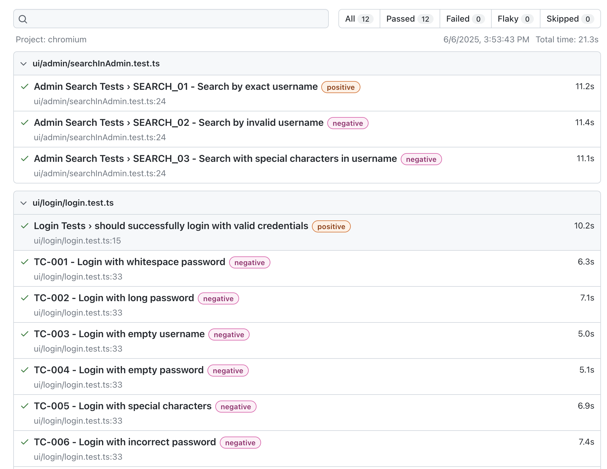
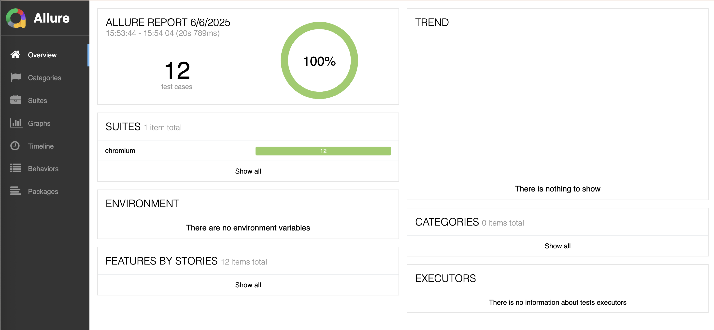

# OrangeHRM E2E Automation Framework

This is a comprehensive automation framework built with Playwright and TypeScript for testing the OrangeHRM application. The framework follows industry best practices and is designed to be modular, scalable, and maintainable.

## 🏗️ Framework Architecture and Design

### Core Components

1. **Page Object Model (POM)**
   - Organized pages into separate classes (LoginPage, MenuPage, AdminPage)
   - Each page encapsulates its own elements and actions
   - Follows the principle of single responsibility
   - Makes test maintenance easier

2. **Test Data Management**
   - Centralized test data in `data` directory
   - Separate files for different test data and scenarios (adminSearchScenarios, loginTestScenarios)
   - Easy to modify and maintain test data

3. **Utility Functions**
   - Custom logger for detailed logging
   - Helper functions for common operations
   - Environment configuration management

4. **Test Organization**
   - Tests organized by feature (login, search)
   - Each test file focuses on specific functionality
   - Clear separation of concerns

### Design Principles

1. **Maintainability**
   - Clear separation of concerns
   - Reusable components
   - Easy to update and modify

2. **Reliability**
   - Built-in retry mechanism
   - Detailed logging
   - Proper error handling
   - Test cleanup after each test

3. **Performance**
   - Parallel test execution
   - Efficient selectors
   - Optimized timeouts
   - Resource management

## ✅ Key Features

- ✅ Cross-browser support (Chrome, Firefox, Safari)
- ✅ Page Object Model (POM) implementation
- ✅ Data-driven testing
- ✅ Configurable environments
- ✅ Modular and scalable structure
- ✅ Professional HTML reporting
- ✅ TypeScript support
- ✅ ESLint and Prettier integration
- ✅ Detailed logging for debugging
- ✅ Test cleanup and isolation
- ✅ Retry mechanism for flaky tests
- ✅ Parallel test execution
- ✅ Screenshot and video recording on failure

## 🏗️ Project Structure

```
├── config/                 # Playwright configuration files
├── pages/                  # Page Object Model classes
├── tests/                  # Test files
│   ├── data/               # Test data and scenarios
│   ├── ui/                 # UI tests
│   └── api/                # API tests
├── utils/                  # Helper utilities
├── .github/workflows/      # CI/CD configuration
├── allure-results/         # Allure test results
├── allure-report/          # Generated Allure report
├── test-results/           # Playwright test results
└── playwright-report/      # Playwright HTML report
```

## 🚀 Setup Instructions

### 1️⃣ Prerequisites

1. Install Node.js 18+ from [nodejs.org](https://nodejs.org/)
2. Install npm (comes with Node.js)
3. Install Git if not already installed

### 2️⃣ Installation Steps

1. Clone the repository:
```bash
git clone https://github.com/jezdang/orangehrm-e2e-playwright.git
cd orangehrm-e2e-playwright
```

2. Install dependencies:
```bash
npm install
```

3. Install Playwright browsers:
```bash
npx playwright install
```

4. Install Allure CLI:
```bash
npm install -g allure-commandline
```

### 3️⃣ Configuration

1. Copy the example environment file:
```bash
cp .env.example .env
```

## 🛠️ Test Organization

### Test File Structure

```
tests/
├── ui/              # UI test files
│   ├── login/       # Login feature tests
│   │   └── login.test.ts
│   └── admin/       # Admin feature tests
│       └── searchInAdmin.test.ts
├── api/            # API test files
│   ├── auth/       # Authentication tests
│   │   └── login.test.ts
│   └── admin/      # Admin API tests
│       └── search.test.ts
└── data/           # Test data files
    ├── loginTestScenarios.ts
    └── adminSearchScenarios.ts
```

2. Configure your test environment in `.env`:
```bash
ORANGEHRM_BASE_URL=https://opensource-demo.orangehrmlive.com
ORANGEHRM_USERNAME=Admin
ORANGEHRM_PASSWORD=admin123
```

3. Configure browser settings:
```bash
BROWSER_TYPE=chromium
HEADLESS=true
```

4. Set timeout values:
```bash
TEST_TIMEOUT=30000
PAGE_TIMEOUT=10000
```

## 🧪 Running Tests

### Basic Test Execution

1. Run all tests with default chrome browser:
```bash
npm test
```

2. Run tests in headed mode (visible browser):
```bash
npm run test:headed
```

3. Generate test report:
```bash
npm run test:report
```

### Advanced Test Execution Options

1. Run specific test by name:
```bash
npm test -- --grep="test name"
# Example: Run only "Login with valid credentials" test
npm test -- --grep="Login with valid credentials"
```

2. Run specific test file:
```bash
npm test tests/ui/login/login.test.ts
```

3. Run tests for specific browser:
```bash
npm test -- --project=chrome
# Other browser options:
# --project=firefox
# --project=webkit
```

4. Run tests with specific configuration:
```bash
npm test -- --config=config/playwright.config.ts
```

5. Run tests with retries:
```bash
npm test -- --retries=2
```

6. Run tests with specific viewport:
```bash
npm test -- --viewport="1280x720"
```

7. Run tests with specific browser settings:
```bash
npm test -- --browser=chromium --headless=false
npm test -- --browser=firefox --headless=false
npm test -- --browser=webkit --headless=false
```

8. Run tests with specific environment variables:
```bash
BROWSER_TYPE=chromium HEADLESS=false npm test
```

9. Run tests with specific timeouts:
```bash
TEST_TIMEOUT=30000 npm test
PAGE_TIMEOUT=10000 npm test
```

### Common Test Execution Scenarios

1. Run specific test cases:
```bash
# Run login tests in Chrome
npm test tests/login.test.ts -- --project=chrome

# Run specific test case in Firefox
npm test -- --grep="should successfully login" -- --project=firefox
```

2. Customize browser settings:
```bash
# Run tests in headed mode with larger viewport
npm test -- --viewport="1920x1080" -- --headed

# Run tests with video recording
VIDEO=true npm test

# Run tests with screenshots on every step
SCREENSHOT=true npm test
```

3. Adjust timeouts:
```bash
# Run tests with increased timeouts
TEST_TIMEOUT=45000 PAGE_TIMEOUT=15000 npm test
```

### Logging

The framework includes a custom logger that provides:
- Timestamped log messages
- Different log levels (info, debug, error, warn)
- Detailed step-by-step logging
- Error tracking and stack traces

Example log output:
```
[INFO] 2025-06-04T17:30:01.980Z - Starting test setup
[INFO] 2025-06-04T17:30:01.981Z - Opening login page
[INFO] 2025-06-04T17:30:05.581Z - Login page opened successfully
[INFO] 2025-06-04T17:30:05.582Z - Starting login process
```

## 📈 Reporting

The framework supports multiple reporting formats:

1. **HTML Report**
   - Built-in Playwright HTML reporter
   - Shows detailed test execution timeline
   - Includes screenshots and videos on failure
   - Accessible via: `http://localhost:9323` after test execution
   - Screenshot:
   

2. **Allure Report**
   - Comprehensive test reporting
   - Detailed test execution timeline
   - Test categorization and grouping
   - Screenshots and videos on failure
   - Accessible via: `http://127.0.0.1:55160` after test execution
   - Screenshot:
   